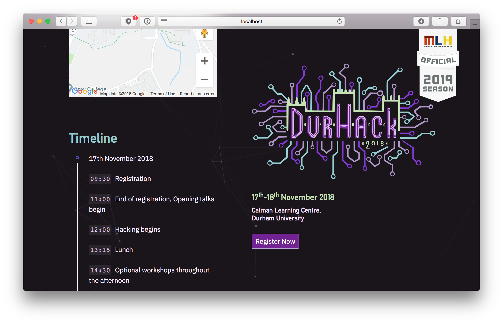

# durhack



These are website assets for the DurHack hackathon (the third one as of writeup on this readme).

## installation

Hopefully, it should be as trivial as cloning the repo, `cd`ing into the repository, and slapping the following commands into the terminal (assuming `node.js` is installed):

```
cd src/
npm start
```

## deployment

Presently, we've used a Digital Ocean box which is covered through the Github Student Pack. [`pm2`](http://pm2.keymetrics.io) is used to run the service as a daemon, with `nginx` acting as a reverse proxy. SSL certificates were created using Let's Encrypt (A good tutorial on how to do this yourself can be found [here](https://www.digitalocean.com/community/tutorials/how-to-secure-nginx-with-let-s-encrypt-on-ubuntu-16-04).) Optionally, there are lots of open source scripts that will act as a git webhook, allowing changes to be deployed as soon as changes are pushed into your repo (similar to how Heroku works), but I'm not sensible enough to allow that to be deployed.

## blah blah blah ok w/e but can I use this for my own hackathon website?

Sure, but obviously don't use our logo and colourscheme or whatever. That'll be silly.

## is this a ruse?

No.
